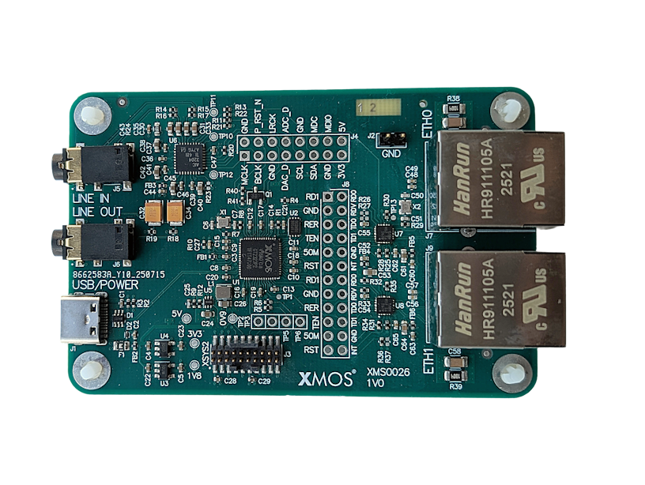
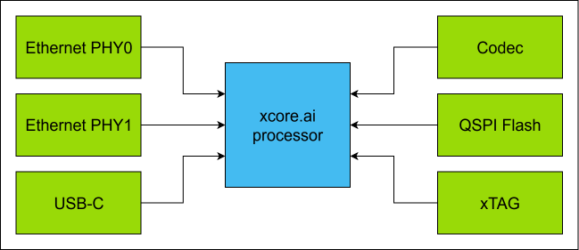
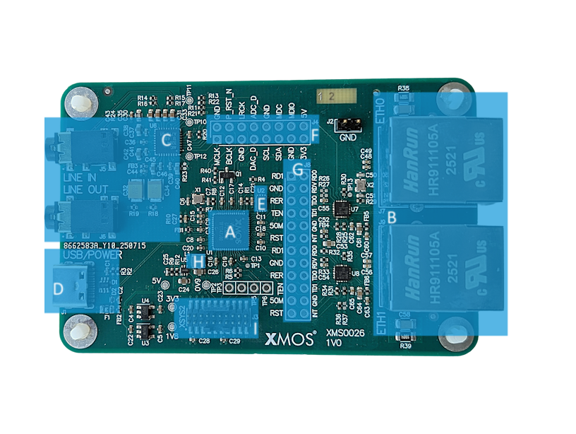

|newpage|

xcore.ai Ethernet Development Kit
=================================

The `xcore.ai Ethernet Development Kit` (XK-ETH-316-DUAL) is an development board for the `xcore.ai` multi-core microcontroller
from `XMOS`.

.. _hw_eth_316_dual_image:

    `xcore.ai` Ethernet Development Kit

The XK-ETH-316-DUAL  allows testing in multiple application scenarios and provides a good general software development
board for simple tests and demos. The XK-ETH-316-DUAL comprises an `xcore.ai` processor with a set of I/O devices and
connectors arranged around it, as shown in :numref:`hw_eth_316_dual_block_diagram`.

.. _hw_eth_316_dual_block_diagram:

    `xcore.ai` Ethernet Development Kit block diagram

External hardware features board include, audio codec with line-in and line-out jack,
QSPI flash memory and a USB-C connector for power and data.

The kit also contains an XTAG debug adapter and is fully supported by the XTC Tools development environment.

For full details regarding the hardware please refer to `XK-ETH-316-DUAL xcore.ai Ethernet Development Kit
<https://www.xmos.com/xk-eth-316-dual>`_.

.. warning::

    The `xcore.ai Ethernet Development Kit` is a general purpose evaluation platform and should be considered
    an "example" rather than a fully fledged reference design.

Hardware Features
-----------------

The location of the various features of the `xcore.ai Ethernet Development Board` is shown in :numref:`hw_eth_316_dual_hw_features_image`.

.. _hw_eth_316_dual_hw_features_image:

    `xcore.ai` Ethernet Development Kit hardware features

It includes the following features:

* A: xcore.ai (XU316-1024-QF60B-C24) device
* B: Dual 100 Base-T Ethernet ports
* C: Audio codec with line-in and line-out jacks
* D: USB-C jack
* E: Quad-SPI flash memory
* F: Audio signal breakout header 2.54mm (0.1")
* G: Ethernet signal breakout header 2.54mm (0.1")
* H: 25 MHz Crystal
* I: XTAG4 debugger connector

Analogue Audio Input & Output
-----------------------------

A stereo CODEC (TLV320AIC3204), connected to the xcore.ai device via an I²S interface, provides analogue input/output
functionality at line level.

The audio CODEC is configured by the `xcore.ai` device via an I²C bus.

Audio Clocking
--------------

`xcore.ai` devices are equipped with a secondary (or `application`) PLL which is used to generate the audio clocks for the CODEC.

LEDs, Buttons and Other IO
--------------------------

Due to the development kit using the QFN60 package these are no IO allocated for LEDs or buttons.

The Ethernet IO signals are available on connector J8, and audio Codec IO signals are available on J4, both 0.1" headers for easy connection.

Power
-----

The `XK-ETH-316-DUAL` requires a 5V power source that is normally provided through the USB-C cable J1.
The voltage is converted by on-board regulators to the 0V9, 1V8 and 3V3 supplies used by the components.

The board should therefore be configured to present itself as a bus powered device when connected to an
active USB host.

Debug
-----

For convenience the kit includes an xTAG4 for debugging via JTAG/xSCOPE. The debugger connects via ribbon connector J3 (marked XSYS2).
The debugger is accessed via the USB (micro-B) receptacle of the xTAG.
